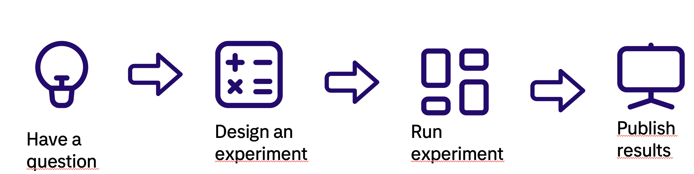

# Experimenting for More Efficient and Green Software

## Part 1: Introduction

Welcome to this workshop which focuses on creating experiments to help make decisions for more efficient and green software! You will learn how to design and conduct experiments to determine how to develop software that is time and resource efficient and, by extension, also environmentally friendly.

### Objectives

The objectives of this workshop are:

* To understand the importance of green software development
* To learn how to design and conduct experiments
* Make choices that result in more efficient and greener code
* Have fun answering questions

### Anatomy of an experiment

The design and execution of rigorous experiments fit for publication in
academic journals is well out of the scope of this workshop. Instead we propose
a simple model for experiments designed to reduce uncertainty.

The figure below shows the general flow of an experiment. The first step is to
find a question. Step two is too design an experiment to answer, or reduce uncertainty, about the question and to create whatever software is needed to run the experiment. Then you run the experiment draw whatever conclusions
that are warranted and finally publish your results and, preferably, use them
to inform future decisions.

## Step 1: Identifying a Question

The best questions are the ones that informs an immediate decision or
satisfies your curiosity. An example of such a question that might arise
when you are writing code might be what is actually the best way to
parse a simple date?

Since it may be hard to think of a question right on the spot when doing 
a workshop, we have compiled a list of questions. For each question, we have
provided example experiment designs and code. To get maximal effect of this workshop, you should only look at the designs for other questions for ideas on designing you own experiment to answer your selected question.

### List of questions

*Q1: What is the effect of declaring a value inside vs outside a loop in
    * Python
    * Java
*Q2: What is the effect of using async/await in c# where it is not entirely Necessary?
*Q3: What is the most efficient way to parse a date in Java?

## Step 2: Designing your Experiment

When designing an experiment it is useful to keep in mind that the
purpose of any measurement is to reduce uncertainty and not
to provide absolute proof. Also, if an experiment does not give any clear
answers,  an always improve on the experiment to increase confidence
in your results. It can also be useful to vary the conditions under which
an experiment is conducted.

When designing an experiment where direct measurement is difficult, you first have to decide on proxies to measure. Perhaps the simplest way to create an experiment for measuring run-time and energy efficency is to measure time it takes to complete a task. Time and energy efficency are strongly corrolated, however one should be aware that
there are situations when they diverge.

Next, you should decide on what to measure. If your question is on the form
is it (much) more efficient to do x by doing x rather than y, one strategy may be to implement one program that uses the x approach and one that uses y. An example of this, if we are interested in knowing whether one way of parsing dates is more efficient than another might be to create a program that times and performs the operation a number of times in one way, and another program that does the same and only differs by parsing the date in some other way. Another approach, shown below might be to do both sequentially in a single program.

## Step 3: Running the Experiment

To run the experiment, simply execute the program or programs you created in the design phase. It may be useful to execute the programs several times and record the
results in order to ensure consistent result. Furthermore, it may also be useful to vary the programs in broader to discover how to best interpret the results.

## Step 4: Publish Results

In this workshop we will present our findings to the group in the form of mini-presentations. We suggest the following format for your presentation:

1. The question you chose
2. The experimental design and code you created
3. The results from running
4. What you have learned

